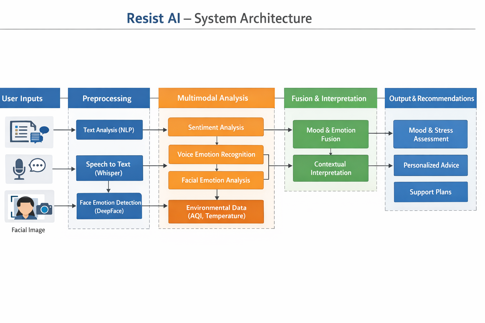

# Resist AI – Multimodal Mental Health Assistant

A practical, human-centered AI system that understands user emotions from text, voice, and facial expressions, and provides supportive, context-aware guidance.

---

## What is Resist AI?

Resist AI is a multimodal emotion understanding system. It combines:

- Text sentiment (what the user writes)
- Voice cues (speech patterns and tone)
- Facial expressions (visual emotion detection)
- Environment context (AQI and temperature)

By integrating these signals, the system produces a more reliable mood estimate and generates helpful recommendations.

---

## Key Capabilities

- Text Analysis – detects mood and polarity from user input  
- Voice Analysis – converts speech to text (Whisper) and evaluates mood  
- Face Analysis – extracts dominant emotion from camera frames (DeepFace)  
- Multimodal Fusion – combines multiple signals for improved accuracy  
- Context-Aware Advice – adapts suggestions using AQI and temperature  
- Support Plan – generates short, actionable steps and daily check-ins  

---

## System Architecture

Below is a simplified view of how data flows through the system.

### Architecture Diagram



---

## Project Structure

```
resist-ai/
├── app.py                 # Main Flask application
├── model.py               # AI logic (mood analysis, fusion)
├── utils.py               # Helper functions (environment, utilities)
│
├── templates/             # HTML templates
│   └── index.html
│
├── static/                # Static assets
│   ├── css/
│   ├── js/
│   └── images/
│
├── architecture.png       # System architecture diagram
├── requirements.txt       # Python dependencies
├── .gitignore             # Ignored files
└── READM
```


## Project Structure
